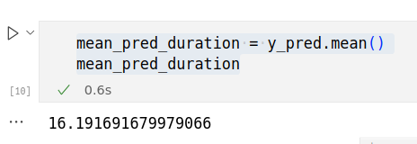
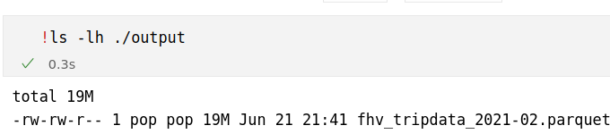
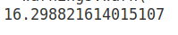
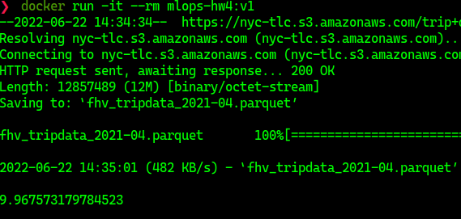

# MLZ Module 4

Code placed inside the `code` folder


# Q1

```bash
mean_pred_duration = y_pred.mean()
mean_pred_duration
```

Ans: 16.19

# Q2




Ans: 19 mb

# Q3


```bash
jupyter nbconvert --to script starter.ipynb     
```


# Q4

N/A
(Don't use pipenv)

# Q5




Ans: 16.29


# Q6




```
docker build -t mlops-hw4:v1 .
docker run -it --rm mlops-hw4:v1

```


Ans: 9.96